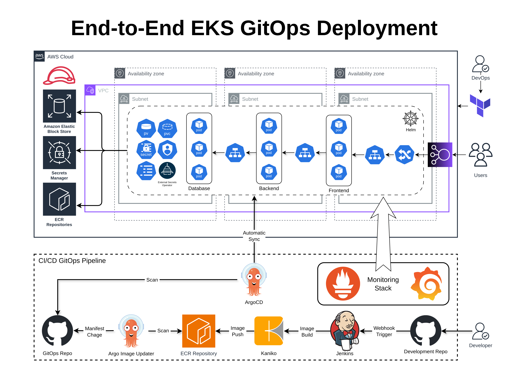

# End-to-End EKS GitOps for Full-Stack To-Do List App

A production-grade, fully automated infrastructure and CI/CD platform for deploying a 3-tier full-stack application on Amazon EKS using GitOps, ArgoCD, Jenkins, and Terraform.

---

## Table of Contents

- [Project Overview](#project-overview)
- [Architecture](#architecture)
- [Tech Stack](#tech-stack)
- [Features](#features)
- [Repository Structure](#repository-structure)
- [Prerequisites](#prerequisites)
- [Setup & Deployment](#setup--deployment)
- [CI/CD Pipeline](#cicd-pipeline)
- [Application Details](#application-details)
- [Security](#security)
- [Cleanup](#cleanup)
- [Contributing](#contributing)

---

## Project Overview

This project provides a complete Infrastructure as Code (IaC) and GitOps solution for deploying and managing a production-ready 3-tier [To-Do List App](https://github.com/muhamad-mamoun/full-stack-todo-list-app.git) on AWS EKS. It leverages Terraform for infrastructure provisioning, Helm for Kubernetes manifests, Jenkins for CI, ArgoCD for GitOps CD, and integrates AWS best practices for security, scalability, and automation.

---

## Architecture



- **VPC** with public/private subnets, NAT Gateway, and security groups
- **EKS Cluster** with managed node groups, OIDC, and IAM roles for service accounts
- **Jenkins** for CI pipeline, running on EKS with persistent storage
- **ArgoCD** for GitOps-based continuous deployment
- **Amazon ECR** for container image registry
- **Helm** for templated Kubernetes manifests
- **Kaniko** for secure container builds inside Kubernetes
- **Ingress** with AWS Load Balancer Controller

---

## Tech Stack

- **Cloud Provider:** AWS
- **IaC:** Terraform
- **Kubernetes:** Amazon EKS
- **CI/CD:** Jenkins, ArgoCD
- **Container Registry:** Amazon ECR
- **GitOps:** ArgoCD, GitHub
- **Helm:** Kubernetes package manager
- **Kaniko:** Secure container image builds
- **Languages:** YAML, HCL, Bash
- **Security:** OIDC, IAM Roles for Service Accounts, Bastion Host, Private Networking

---

## Features

- Automated provisioning of AWS infrastructure (VPC, EKS, ECR, IAM, etc.)
- Secure, scalable, and highly available Kubernetes cluster
- CI pipeline with Jenkins for building and pushing Docker images
- GitOps deployment with ArgoCD and Helm
- 3-tier application (frontend, backend, database) with persistent storage
- Secure access via Bastion host and private subnets
- OIDC integration for fine-grained IAM permissions
- Ingress with AWS Load Balancer Controller
- Parameterized and modular Terraform codebase
- Automated ECR repository creation and image scanning
- ArgoCD Image Updater integration for automatic image updates

---

## Repository Structure

```
.
├── Terraform/           # Infrastructure as Code (modular Terraform)
│   ├── main.tf
│   ├── Modules/
│   │   ├── Cluster/
│   │   ├── Compute/
│   │   ├── Helm/
│   │   ├── Identity/
│   │   ├── Kubernetes/
│   │   ├── Network/
│   │   ├── OIDC/
│   │   ├── Registry/
│   │   └── Security/
│   └── ...
├── Manifest/            # Helm chart for the 3-tier application
│   ├── Chart.yaml
│   ├── values.yaml
│   └── templates/
├── Jenkinsfile          # Jenkins CI pipeline definition
├── Docs/
│   └── architecture.png
└── README.md            # Project documentation
```

---

## Prerequisites

- AWS CLI configured with admin access
- Terraform >= 1.0
- kubectl >= 1.22
- helm >= 3.0
- Docker
- GitHub account and personal access token (for ArgoCD GitOps)
- [Full-stack Todo List App](https://github.com/muhamad-mamoun/full-stack-todo-list-app.git) Docker images built or available

---

## Setup & Deployment

### 1. Clone the Repository

```bash
git clone https://github.com/your-org/End-to-End-EKS-GitOps.git
cd End-to-End-EKS-GitOps
```

### 2. Prepare Secrets

Create a `secrets.tfvars` file in the `Terraform/` directory with the following content:

```hcl
aws-profile            = "your-aws-profile"
region                 = "your-aws-region"
admin-public-ip        = "your-public-ip"
backend-jwt-secret     = "your-jwt-secret"
database-root-password = "db-root-pass"
database-password      = "db-pass"
database-username      = "db-user"
jenkins-username       = "jenkins-user"
jenkins-password       = "jenkins-pass"
argocd-hashed-password = "bcrypt-hash"
github-username        = "your-github-username"
github-password        = "your-github-token"
gitops-repo-url        = "https://github.com/your-org/full-stack-todo-list-app.git"
application-namespace  = "app"
application-volume-id  = "your-ebs-volume-id"
jenkins-volume-id      = "your-ebs-volume-id"
```

### 3. Deploy Everything with One Command

A major strength of this project is its **single-command deployment**: by running the following, all infrastructure and workloads (including CI/CD and the application) are provisioned and deployed automatically—no manual Helm or kubectl steps required.

```bash
cd Terraform
terraform init
terraform apply -var-file="secrets.tfvars"
```

Terraform will orchestrate the full setup: VPC, EKS, Jenkins, ArgoCD, ECR, IAM, and the 3-tier application, all in a single workflow.

---

## CI/CD Pipeline

- **Jenkins** builds Docker images for frontend and backend, pushes to ECR.
- **ArgoCD** watches the GitOps repo and syncs Kubernetes manifests to EKS.
- **ArgoCD Image Updater**: Automatically updates images in the manifests based on new tags in ECR.
- **Automated ECR login and image push**: Terraform provisions ECR repositories and pushes initial images.

---

## Application Details

- **Frontend**: HTML, CSS, and JS (see [full-stack-todo-list-app](https://github.com/muhamad-mamoun/full-stack-todo-list-app.git))
- **Backend**: Node.js/Express API
- **Database**: MySQL (StatefulSet with persistent EBS volume)
- **Helm values**: All configuration is parameterized in `Manifest/values.yaml`
- **Ingress**: Configurable via Helm, supports AWS Load Balancer

---

## Security

- **OIDC** for IAM Roles for Service Accounts (least privilege)
- **Secrets** managed via Kubernetes and AWS Secrets Manager
- **Network isolation** with public/private subnets

---

## Cleanup

To destroy all resources:

```bash
cd Terraform
terraform destroy -var-file="secrets.tfvars"
```

---

**Author:** Mamoun  
Email: muhamad.mamoun@gmail.com
